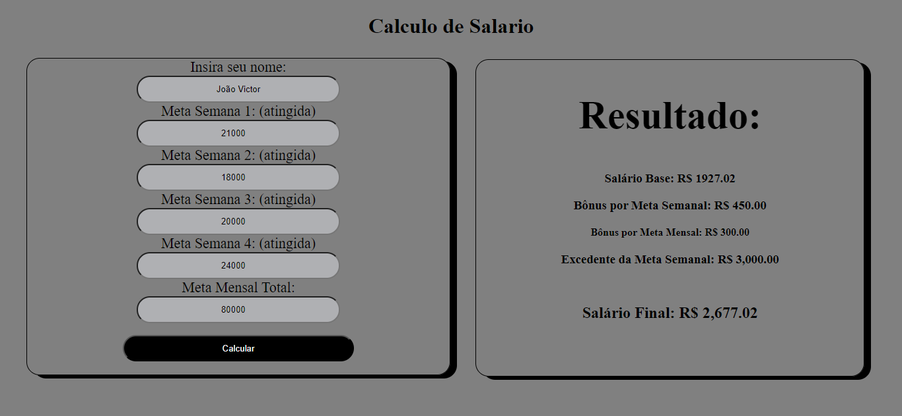
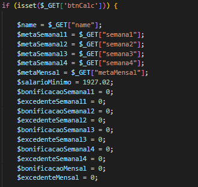
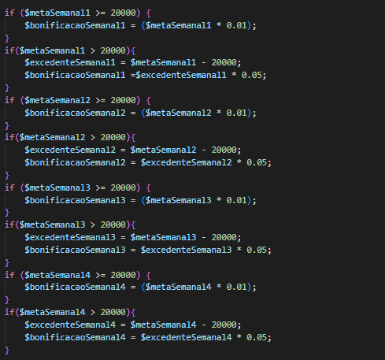
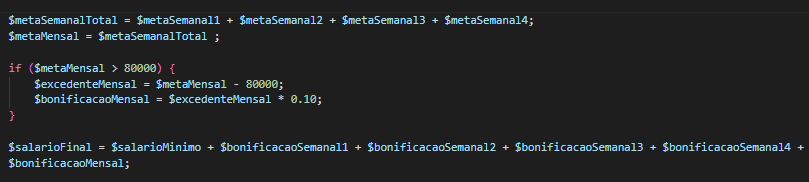

<h1>
💵 Sistema Calculo Salarial 💵
</h1>

## 🗒️ Projeto

O projeto é um script PHP que calcula o salário final de um funcionário, considerando seu salário base e bônus por metas semanais e mensais. O script coleta dados do usuário, calcula o bônus e o salário final, e exibe os resultados na página HTML. O objetivo é automatizar o cálculo de salários com bônus, aumentar a precisão e a transparência, e facilitar a gestão de pessoal. O script pode ser usado por empresas, freelancers e empreendedores. As melhorias futuras incluem validação de dados, mensagens de erro, taxas de bônus personalizadas e cálculo de salário líquido.

## 📖 Descrição

Nessa atividade, criamos uma calculadora que auxilia o pagamento dos salários de uma determinada empresa que utiliza o método de "meritocracia" para pagar seus funcionários. Os principais requisitos dessa atividade foram:

## ⚙️ Funcionalidade

A funcionalidade principal do código é calcular o salário final de um vendedor, levando em consideração diversos fatores:

#### 🗒️ Dado do vendedor:
 * Nome informado 
 * Salario Minimo Definido

#### 💹 Definidos:
 * Salário Minimo: R$1927.02 
 * Meta Semanal: R$20000.00 
 * Meta Mensal: R$80000.00

 * Bônus Semanal: 1% se atingida a meta semanal 
 * Bônus Mensal: 5% se exeder a meta

#### 💵 Salário Final:
 * Salario Minimo : 1927,02 
 * Cálculo: Salário final é a soma do salário mínimo, bônus semanais,  * bônus excedentes semanais e bônus excedente mensal.

#### ✅ Conclusão:
 * Bônus Semanal: Bônus de 1% para cada real que a venda da semana exceder 25% da meta mensal.
 * Bônus Excedente Semanal: Bônus de 5% para cada real que a venda da semana exceder a meta específica da semana.
 * Bônus Excedente Mensal: Bônus de 10% para cada real que o total de vendas do mês exceder a meta mensal.

#### Resultado:
Apresenta o nome do vendedor, o valor do salário mínimo, os detalhes dos bônus semanais e excedentes, e o salário final calculado.

## 🆘 Metodo

| Método| Explicação |
|------|------|
| isset | Determina se uma variável é considerada definida, isto é, está declarada e é diferente de null.|

## 💻 Técnologia Utilizadas

| Tecnologia | Tipo |
|------------|------|
| 📕 HTML | Marcação |
| 🐘 PHP | Script |
| 🖌️ CSS | Estilização |
| 🕹️ GitHub | Controle de versão |
| 🆚 Git | Versionamento de Código |
| 🖥️ Xampp/Apache | Hospedagem local |

## 🌆 Demonstração

### Localhost Index.php rodando

 Página principal mostrando os dados do calculo já feito com os dados:  

* Nome: João Victor
 

* Meta da Semana 1 atingida: R$ 21.000
 

* Meta da Semana 2 atingida: R$ 18.000
 

* Meta da Semana 3 atingida: R$ 20.000
 

* Meta da Semana 4 atingida: R$ 24.000

 

  

### Declarando as Variáveis

 

  

### Calculo de meta Semanais

 

### Calculo da meta Mensal

 

  

## 🔤 Fontes Consultadas

[Gemini](https://gemini.google.com)
 
[PHP Guia](https://www.php.net/manual/pt_BR/function.isset.php)
 
[Github](https://github.com)
 
[BlackBox](https://www.blackbox.ai/)

## Autores

### * 👨‍💻 Programador

| [ João Victor Farias](https://github.com/joaovictorgit21)
| :--: |

### * 👨‍🏫 Docente

| [ Leonardo Rocha / Marista](https://github.com/LeonardoRochaMarista)
| :--: |
